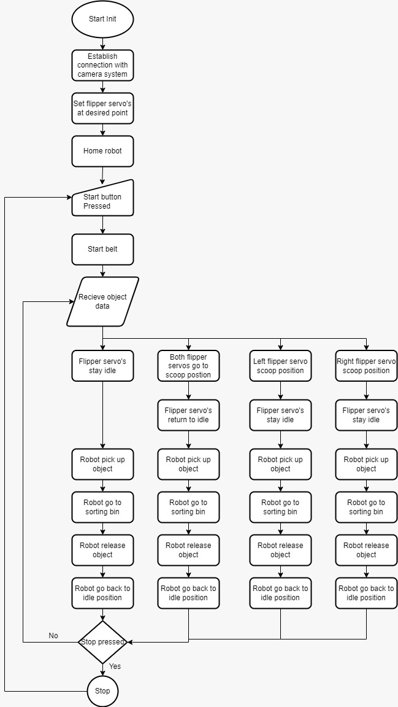
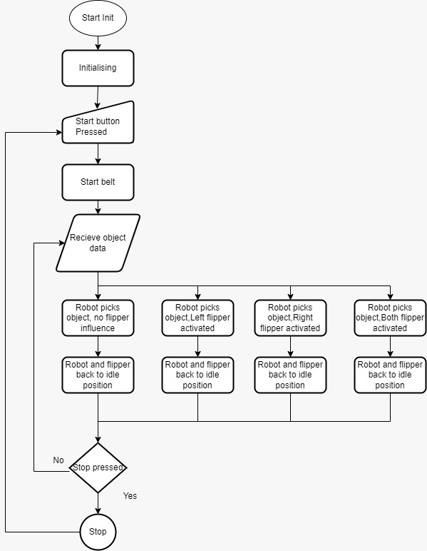

# Procces, FlowControl & Diagrams
1. Detection with line scan camera: 
The line camera continuously scans the metals on the moving conveyor belt, capturing one line of an image at a time. All these line photo's whill be put together to create an image.

2. AI recognition:
The AI analyzes these images to identify the type of metal for example copper or aluminum. The right type of metal whill be chosen by comparing the images to a data base with all the metals.

3. Location calculation and robot arm control:
The system calculates the metal’s current position based on the time elapsed and speed of the conveyer belt. The robot arm uses this calculation to pick up the object at the correct moment. The robot does this by using 3 axis one that moves above the conveyer belt in the y direction, the other ones is for the z direction to pick the metal from the belt and the last one is to rotate the gripper.

4. Sorting:
The robot arm moves each piece of metal to the appropriate location, such as a bin or container for that specific metal type.

Shown below is a diagram of how the system is used
```plantuml
@startuml
actor User
actor ConveyorBelt as CB
actor LineCamera as LC
actor AIRecognition as AI
actor MetalDatabase as DB
actor PositionCalculator as PC
actor RobotArm as RA

== Start Conveyor Belt ==
User -> CB : Start conveyor belt

== Metal Detection ==
CB -> LC : Move metal objects on conveyor
LC -> LC : Detect metals and capture image
LC -> AI : Send image to AI for recognition

== AI Metal Recognition ==
AI -> DB : Compare image with metal database
DB --> AI : Return metal type (e.g., Copper, Aluminum)

== Location Calculation ==
AI -> PC : Send metal type and detection time
PC -> CB : Retrieve conveyor speed
PC -> RA : Calculate position of metal

== Robot Arm Action ==
RA -> RA : Move to calculated position
RA -> RA : Pick up metal
RA -> RA : Place metal in the correct container
@enduml
```
See the figure below for the flowchart

**Image_3: (Image of Flowchart)**

See the figure below for the simplefied flowchart

**Image_3: (Image of Simplefied Flowchart)**